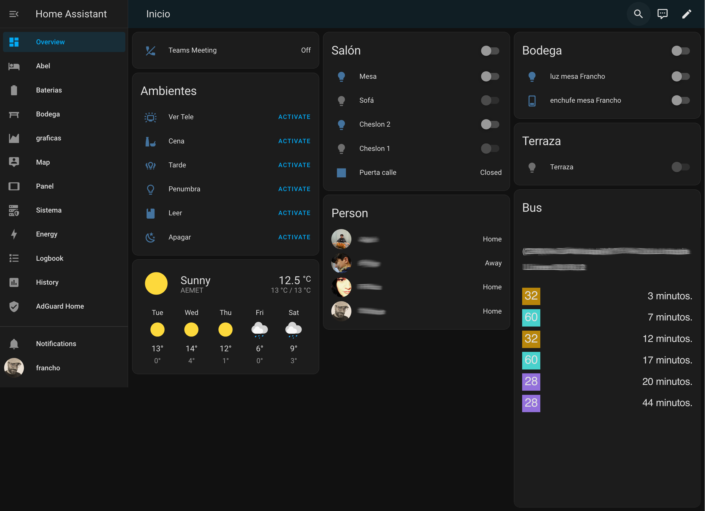

<Section >

Llevo un tiempo tratando de domotizar mi casa bajo las siguientes premisas:

- Sistema que respete nuestra privacidad (no quiero meter micrófonos en mi casa que no controle yo). Esto descarta soluciones tipo Alexa, Google Home o similares.
- Seguridad
- Independencia de la red (no quiero que mis luces dejen de funcionar porque se haya caído la conexión a internet)
- Solución abierta que me permita ir añadiendo y modificando dispositivos conforme pasen los años

## Actualmente tengo funcionando:

- detección de apertura de puertas
- control de luces / escenas
- sensor de detección de gases
- alertas
- aviso a cenar
- control spam y privacidad a traves de dns de dispositivos de casa
- aviso de reuniones de teams
- control del DNS interno con adblocker (flipante la cantidad de tráfico que genera la Tele)

## Hardware que uso:

- Raspberry Pi 4
- Pincho ConBee II (si quieres Zigbee)
- Dispositivos Zibgee que he probado:
  - Bombillas Ikea TRADFRI bulb GU10 WS 400lm
  - Interruptor Ikea Tradfri Remote Control N2
  - Interruptor Ikea Tradfri Remote Control v1
  - Lampara Ikea FLOALT panel WS 30x90
  - Bombillas Philips Hue white ambiance
  - Enchufe Innr
- Dispositivos Wifi
  - Enchufe Shelly plug S
- Dispositivos Bluetooth
  - Xiaomi Mi Plant
</Section>