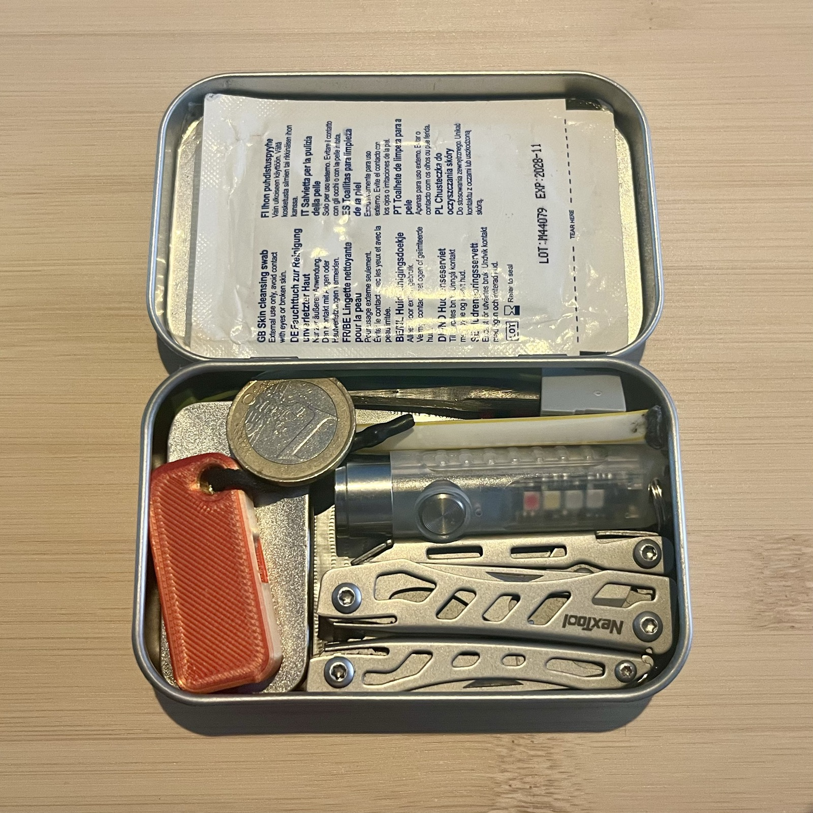
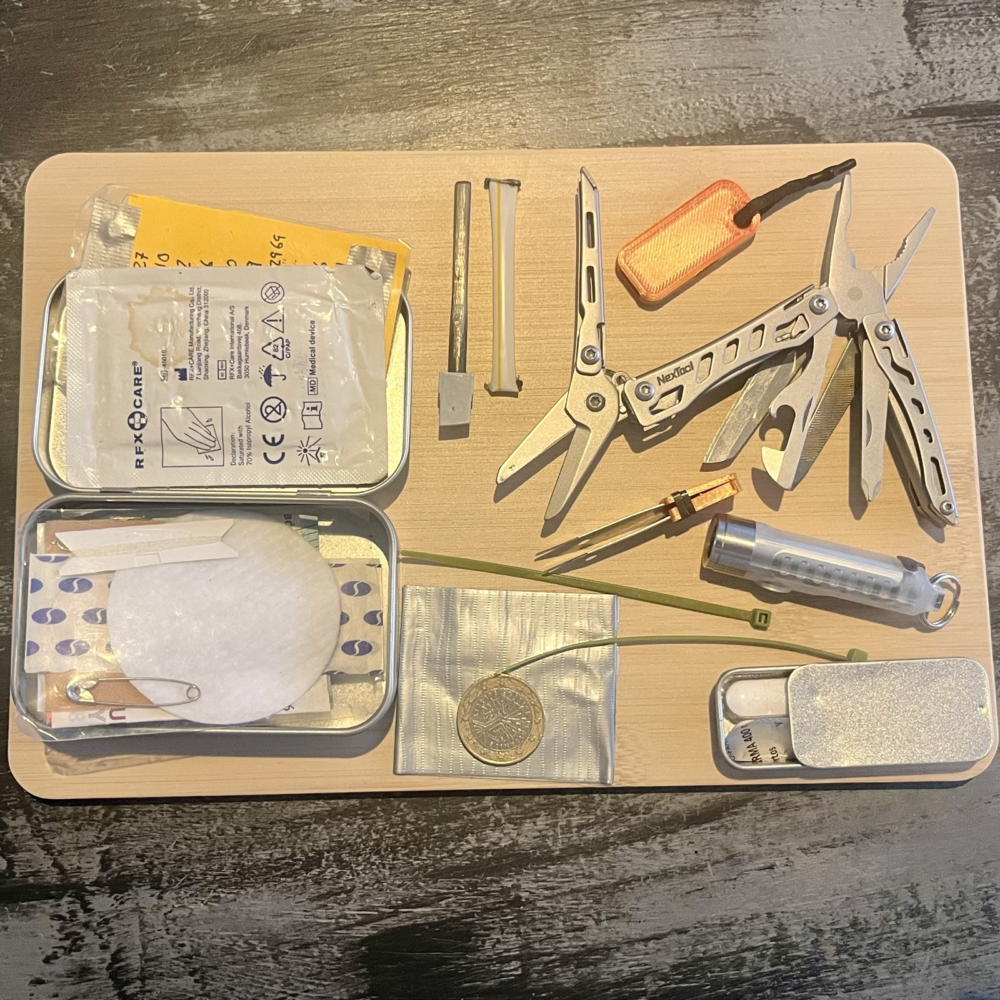

Me ha dado por montarme EDC (Everyday Carry), me gusta el reto de meter cuantas más cosas útiles mejor en un espacio reducido. 

Realmente ya es algo que llevo haciendo años y mis mochilas están llenas de cosas que puedo necesitar: en la de montaña, por ejemplo, llevo botiquín, materiales de reparación para emergencias, kits de fuego, cordino... el llevar esto a otros niveles y encima de que sean útiles me enganchó.

Es un proceso divertido en constante evolución donde voy metiendo y sacando cosas según veo su utilidad real.

De momento tengo montadas:

## La EDC que suelo coger cuando salgo de casa

Es una lata [tipo caja de Altoids](https://www.amazon.es/dp/B0CR2TCFXR) de 9,5x6x2,2cm con:

- Lista de teléfonos de contacto escrita en papel por si me quedo sin batería.
- Dinero de emergencia (billetes), por si no funciona el pago con tarjeta
- 1 euro. No suelo llevar monedas en el bolsillo, y a veces no he podido coger un carro o pagar un parking
- Toallita desinfectante para heridas, limpiar manos
- Unas pinzas, para sacar por ejemplo astillas
- Algodón, para heridas o (mezclado con la vaselina) como iniciador de fuego
- Un poco de vaselina, para los labios cortados, o encender fuego
- Paracetamol e Ibuprofeno en una [minicaja](https://www.amazon.es/dp/B00JHKZBQM)
- Una multiherramienta [NextTool Mini flagship pro con 12 herramientas](https://nextoolstore.com/products/mini-flagship%E4%B8%A8nextool%C2%AE)
- Una [linterna pequeña de 400LM](https://www.amazon.es/dp/B096MHBSDG), con varios modos que alumbra un montón, muy útil cuando saco en invierno a los perros por caminos oscuros o para marcar mi posición cuando ando de noche por carreteras. Además tiene un potente imán para fijarla o coger cosas metálicas.
- Útiles de costura: hilo, aguja e imperdible
- Un par de bridas pequeñas
- Cinta americana
- Silbato emergencias (impreso con la 3D)
- Un [encendedor de ferrocerio](https://www.victorinox.com/es/Productos/Swiss-Army-Knife%E2%84%A2-and-Tools/Cuidado-de-navajas/Pedernal-para-Venture-Pro/p/4.1333), ahora que no fumo me ha sacado de más de un apuro en alguna barbacoa, aunque creo que este va a ir al EDC de la mochila de montaña y aquí meteré cerillas o un mechero pequeño que quepa

También suelo coger un [powerbank de emergencia](https://rollingsquare.com/products/tau-2-a-new-kind-of-power-bank)  para el móvil, antes lo llevaba dentro (usaba una un monedero de tela), ahora lo llevo como llavero.

Estoy pensando en meterle también:

- Un usb encriptado con mi documentación (tarjeta sanitaria, DNI, documentos escaneados), salvaguarda de mis fotos preferida... Me falta encontrar la mejor forma de hacer esto

