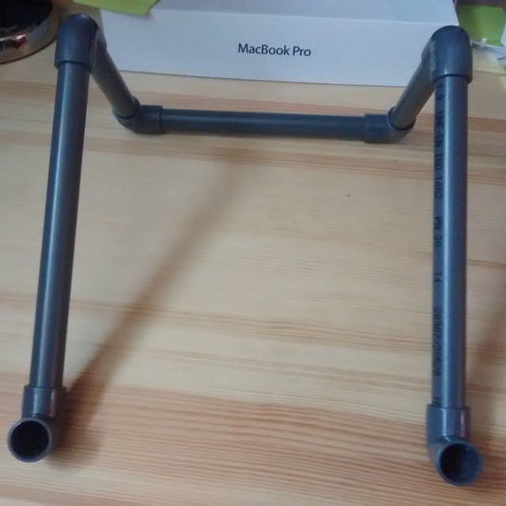
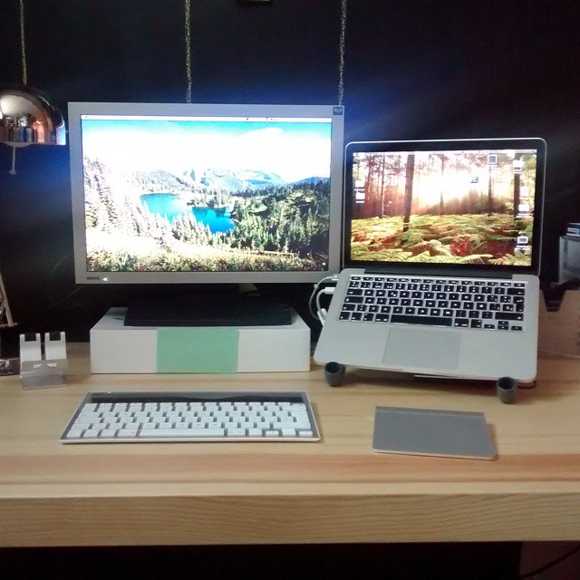
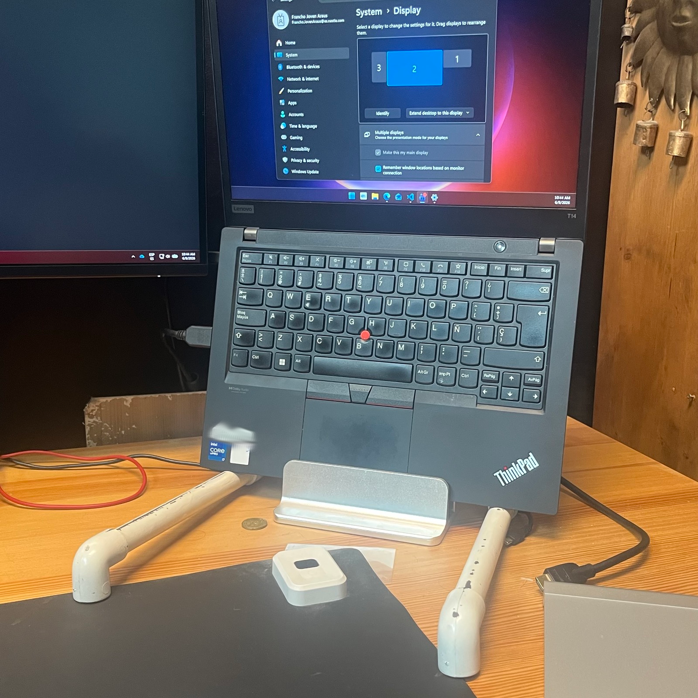

Después de probar varias alternativas, me he quedado con este soporte hecho con tubos de PVC que a día de hoy sigo utilizando.

Es bueno (mantiene el portátil elevado facilitando la circulación de aire), bonito (muy discreto) y barato (el coste de los materiales es irrisorio).

Materiales:

- tubo de PVC cortado en 5 tramos (calcula las medidas en base a tu portatil y la altura en la que quieres que quede)
- 6 codos de 90 grados
- pintura en spray si lo quieres tunear

Hace poco, tratando de organizar mi escritorio para hacer hueco a un segundo portátil con el que tengo que trabajar para mi actual cliente, he descubierto que dándole la vuelta sirve para tener los dos uno encima de otro. Le he colocado una base que tenía por casa para asegurarme de que no vuelque si levanto el portátil de abajo, aunque no le hace falta.

