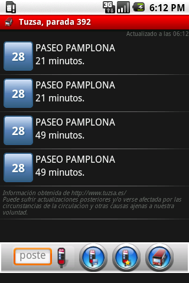

Evita plantones inecesarios, consulta la información de la parada antes de salir de casa o de la oficina.

ZgzBus es una aplicación para móviles Android que te permite consultar cuando va a llegar un autobús a una determinada parada.

Es una aplicación pensada para funcionar con los autobuses urbanos de Zaragoza (T.U.Z.S.A)

**¿Ya está terminada la aplicación?**

No, esta es una versión inicial que tenía desarrollada para uso personal y que he publicado a petición popular (hay varios amigos que la querían usar).

Es totalmente operativa: solo necesitas saber el número de parada para consultar la información de llegada (o usar el buscador de paradas incorporado).

Una vez encontrada tu parada, puedes guardarla en tus favoritos para poder consultarla cuando quieras.

Tambien puedes fijar alarmas para que el móvil te avise antes de que llegue tu autobús.

¡Estate atent@ a las actualizaciones!

**¿Como me la instalo?**

Puedes buscarla en el market por el nombre zgzBus.

Si tienes instalado BarcodeScanner, solo tienes que escanear el código QR.

**¿Y para mi ciudad cuando va a salir?**

En un principio no tengo previsto sacar versiones para otras ciudades.

Si eres programador, puedes usar el [código fuente](http://code.google.com/p/zgzbus) para crear tu propia aplicación para tu ciudad.

**¿De donde saca los datos?**

Los datos los obtiene de Internet, de la página oficial [Tuzsa](http://www.tuzsa.es).

**¿Y el icono donde lo has conseguido?**

El icono me lo ha hecho por encargo Irene Joven. Si quieres puedes contactar con ella a través de su web [kambia2.com](http://www.kambia2.com/)

**Histórico de cambios**

*   4/11/2010 - version 0.6.3 - Añadidas preferencias de usuario. Arreglado bug ANR. Añadidos banners con fines estadísticos
*   18/5/2010 - versión 0.6 - Añadido sistema de alarmas. Pequeños cambios estéticos
*   18/4/2010 - versión 0.5.2 - Solucinaodos pequeños bugs no críticos
*   21/3/2010 - versión 0.5 - Añadido buscador de paradas
*   17/3/2010 - versión 0.4.6 - Soluciona problemas de arranque en los Android 2.x
*   5/3/2010 - versión 0.4.5 - Organización de código. Mejoras de usabilidad basadas en [sugerencia de usuario](http://code.google.com/p/zgzbus/issues/detail?id=3&can=1&q=label:Type-Defect)
*   25/2/2010 - versión 0.4.4 - Cambios estéticos
*   22/2/2010 - versión 0.4 - Múltiples mejoras: refresco automático y gestión de favoritos
*   7/2/2010 - versión 0.3.3 - Soluciona el problema que tenían los móviles sin teclado físico
*   6/2/2010 - versión 0.1 - Subida al Android Market la versión incial

**He encontrado un fallo en la aplicación**

Te agradecería que abrieras una incidencia [aquí](http://code.google.com/p/zgzbus/issues/entry). Detalla al máximo lo que te pasa, así como tu modelo de móvil y todo lo que consideres necesario para que pueda reproducir el error y solucionarlo.
